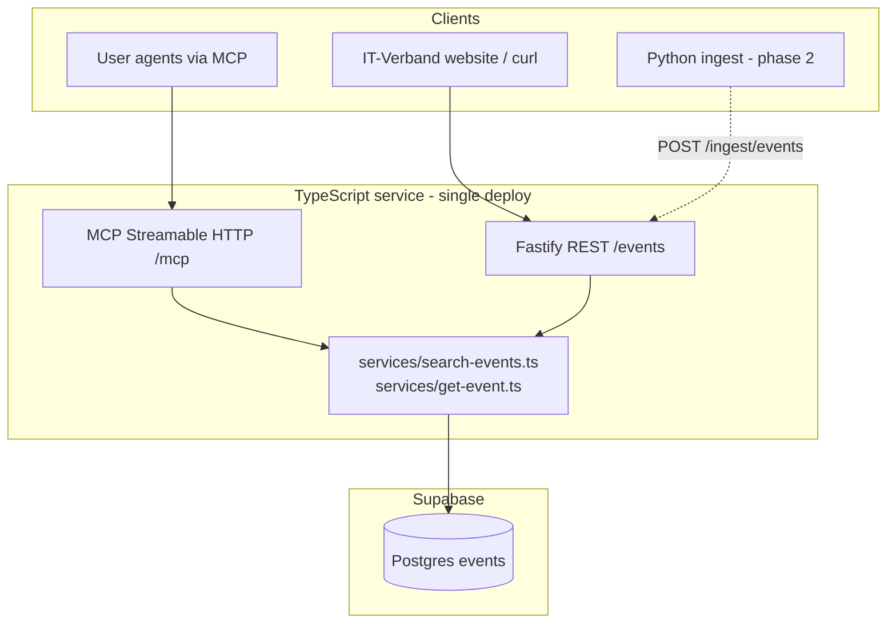

# API + MCP Find Events — Design (v1)

**Date:** 2026-06-25  
**Status:** Approved  
**Related:** [Team design](./2026-06-25-mainfranken-it-events-design.md), [SPEC.md](../../../SPEC.md)

## Summary

Ship a **read-only find-events** vertical slice: TypeScript service with shared search logic, exposed as **REST** (humans, IT-Verband website, integrations) and **remote MCP tools** (user agents). Supabase Postgres is the datastore; schema and seed data already exist.

**v1 scope:** `search_events` / `get_event` only — no auth, RSVP, OTP, or ingest.

## Locked decisions

| Topic | Choice |
|---|---|
| v1 scope | Find events only (public read/search) |
| MCP transport | Remote Streamable HTTP |
| Language | TypeScript (API + MCP); colleague uses Python for ADK ingest |
| HTTP framework | Fastify |
| MCP SDK | `@modelcontextprotocol/sdk` |
| Database | Supabase Postgres (existing `events` table) |
| Architecture | Monolithic service — shared `services/`, thin REST + MCP adapters |
| Runtime | **Node 24** |
| Dependencies | **Latest stable versions** of all packages at install time |
| Data for v1 | Existing seed rows; colleague adds real data via ingest later |

## Architecture



### Approach considered

| Approach | Verdict |
|---|---|
| **A) Monolithic Fastify** — REST + MCP + shared services in one process | **Selected** |
| B) Split API + MCP — MCP calls REST over HTTP | Rejected for v1 (extra hop, two deploys) |
| C) PostgREST + thin MCP | Rejected (weak multi-filter search, no owned API contract) |

### Shared logic pattern

Both REST routes and MCP tools call the same service functions — **not** an internal HTTP loop:

```
GET /events/search          MCP tool: search_events
        \                          /
         \                        /
          searchEvents(filters)
                    │
                    ▼
               Supabase
```

REST remains the **public contract** for external consumers (website, curl, future Python ingest). MCP tools mirror the same parameters and response shape.

### Repo layout

```
src/
  lib/supabase.ts          # server client (service role)
  services/
    search-events.ts       # core search logic
    get-event.ts
  routes/events.ts         # Fastify plugin
  mcp/
    server.ts              # MCP server + Streamable HTTP mount
    tools.ts               # search_events, get_event registrations
  app.ts                   # Fastify bootstrap
```

## Tech stack

| Layer | Package / tool |
|---|---|
| Runtime | Node **24** |
| Language | TypeScript (latest) |
| HTTP | Fastify (latest) |
| MCP | `@modelcontextprotocol/sdk` (latest) |
| DB client | `@supabase/supabase-js` (latest) |
| Validation | Zod (latest) |
| Tests | Vitest (latest) |

Pin exact versions in `package.json` at scaffold time; prefer `npm install <pkg>@latest` when initializing. Use `"engines": { "node": ">=24" }` in `package.json`.

## v1 surface area

### In scope

- `GET /events` — search with filters
- `GET /events/:id` — single event by UUID
- MCP tools: `search_events`, `get_event` (same params/results as REST)
- Public access, no authentication

### Out of scope (v1)

- Auth, PAT, RSVP, OTP, connections
- `POST /ingest/events` (colleague’s Python ADK pipeline — phase 2)
- Admin CRUD (`create_event`, `update_event`, `delete_event`)
- Semantic / embedding search (pgvector stretch)

## Search API

### `GET /events`

| Param | Type | Behavior |
|---|---|---|
| `query` | string? | `ILIKE` on `title` and `description` |
| `date_from` | ISO 8601 date? | `starts_at >= date_from` |
| `date_to` | ISO 8601 date? | `starts_at <= date_to` |
| `city` | string? | match on `city` (case-insensitive) |
| `tags` | comma-separated or repeated? | overlap with `tags` array (`&&`) |
| `is_free` | boolean? | exact match |
| `limit` | number? | default **20**, max **50** |

**Ordering:** `starts_at ASC` (upcoming first).

### `GET /events/:id`

Returns a single event or `404` if not found.

### Response shape

Used by both REST and MCP tool results:

```json
{
  "events": [
    {
      "id": "uuid",
      "title": "Würzburg Web Dev Meetup #42",
      "description": "...",
      "starts_at": "2026-07-08T18:00:00Z",
      "ends_at": null,
      "location_name": "Tech Hub Würzburg",
      "city": "Würzburg",
      "address": null,
      "url": "https://example.com/event",
      "organizer": "Mainfranken Web Dev",
      "tags": ["webdev", "react", "meetup"],
      "is_free": true,
      "price": null
    }
  ],
  "count": 1
}
```

For `get_event`, return a single `event` object (not wrapped in a list).

Fields intentionally exclude internal ingest metadata (`content_hash`, `source`, `embedding`) from public responses unless needed later.

## MCP tools

| Tool | Maps to | Auth |
|---|---|---|
| `search_events` | `GET /events` | none |
| `get_event` | `GET /events/:id` | none |

Tool input schemas mirror REST query params (Zod). Tool descriptions should be agent-friendly: explain filters, defaults, and that results are Mainfranken IT events.

Errors return actionable text the user agent can relay (e.g. “No events found matching city=Würzburg and tags=rust”).

## Data layer

- **Table:** existing `public.events` (schema per team design doc)
- **Seed data:** 6 dummy Mainfranken events already present — sufficient for v1 demo
- **No migrations required** for v1 (read-only)
- **RLS:** events publicly readable; server uses service role key
- **Colleague ingest (phase 2):** Python ADK → `POST /ingest/events` on this service (not direct DB writes), dedupe via `content_hash` in shared ingest logic

## Error handling

| Case | HTTP | MCP |
|---|---|---|
| Event not found | 404 | error with clear message |
| Invalid params | 400 | validation error |
| DB / server failure | 500 | generic message; details logged server-side only |

No sensitive data in error responses.

## Deployment

**Hosting:** Fly.io, Railway, or Render — any platform running a **persistent Node 24** process with public HTTPS.

| Endpoint | Purpose |
|---|---|
| `https://<host>/events` | REST API |
| `https://<host>/mcp` | MCP Streamable HTTP |

**Environment variables:**

- `SUPABASE_URL`
- `SUPABASE_SECRET_KEY` (service role)
- `PORT` (default 3000)

**Local dev:** `npm run dev` — REST and MCP on same port.

**CORS:** enabled on REST for future IT-Verband website.

## Testing

| Layer | What to test |
|---|---|
| `services/search-events.ts` | Filter combinations, limit cap, empty results (mock Supabase) |
| `routes/events.ts` | Fastify `inject()` integration tests |
| MCP smoke | Connect to `/mcp`, call `search_events({ city: "Würzburg" })`, expect ≥1 seed result |

`services/` is the primary test target (equivalent to Python `core/` in team spec).

## Phases after v1

1. Auth (Supabase JWT + PAT) + RSVP tools/endpoints
2. OTP connection flow
3. `POST /ingest/events` for colleague’s Python pipeline
4. FastAPI-equivalent features already in team spec — all via same `services/` growth path

## Open points (deferred)

- Exact hosting provider (Fly vs Railway vs Render)
- `tags` query param format on REST (`?tags=python,meetup` vs repeated `?tags=python&tags=meetup`) — pick one at implementation and document
- Rate limiting / API keys for public REST (not needed for hackathon demo)
