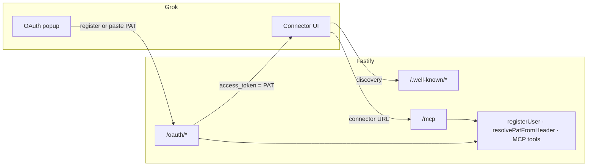

# Grok OAuth PAT Connector — Design

**Date:** 2026-06-26  
**Status:** Approved  
**Related:** [API + MCP design](./2026-06-25-api-mcp-find-events-design.md), [README](../../../README.md)

## Summary

Add a minimal **OAuth 2.1 shell** so Grok custom connectors can authenticate via URL + popup. The popup lets users **request a PAT by email** or **paste an existing PAT**. On success, Grok receives the PAT as the OAuth `access_token` and sends `Authorization: Bearer mfe_pat_…` on MCP calls — identical to Cursor.

**All existing behavior is preserved:** Cursor `mcp.json` headers, REST `/auth/register`, MCP `register_user`, public tools without auth, auth tools with PAT.

## Locked decisions

| Topic | Choice |
|-------|--------|
| Approach | Minimal OAuth in Fastify (same process) |
| First-time Grok users | Request token by email in popup |
| Public MCP tools | Anonymous access preserved (`search_events`, `get_event`, `register_user`) |
| OAuth access token | The PAT itself (`mfe_pat_…`) |
| Cursor / REST | No behavior change |
| Canonical resource URL | `MCP_PUBLIC_URL` env var (e.g. `https://mie.faurobert.fr/mcp`) |

## Goals

1. User adds Grok connector with MCP URL only (no headers).
2. OAuth popup opens with register-by-email + paste-PAT form.
3. Success redirects to Grok; failure shows error on same page.
4. After success, Grok can call auth-gated MCP tools (`set_rsvp`, `list_my_rsvps`, `remove_rsvp`).

## Non-goals (v1)

- Google/GitHub social login in popup
- Separate JWT access tokens (PAT is the token)
- OAuth for REST API routes
- Persisted OAuth state across server restarts (in-memory is acceptable)
- Changes to MCP tool schemas or PAT storage model

## Architecture



### New modules

```
src/oauth/
  store.ts          # in-memory DCR clients, auth codes, PKCE challenges
  pkce.ts           # S256 verify helpers
  metadata.ts       # well-known JSON builders
  authorize-page.ts # HTML form render + parse
  routes.ts         # Fastify plugin
  validate-pat.ts   # thin wrapper around resolvePatFromHeader
```

Register in `src/app.ts` alongside existing routes.

### Env

| Variable | Required | Example |
|----------|----------|---------|
| `MCP_PUBLIC_URL` | Yes | `https://mie.faurobert.fr/mcp` |

Used as OAuth `resource` identifier, protected-resource metadata, and audience validation.

## OAuth protocol

### Discovery

| Endpoint | Spec |
|----------|------|
| `GET /.well-known/oauth-protected-resource/mcp` | RFC 9728 — `resource` = `MCP_PUBLIC_URL`, lists this server as authorization server |
| `GET /.well-known/oauth-authorization-server` | RFC 8414 — authorize, token, register endpoints; `code_challenge_methods_supported: ["S256"]` |

Authorization server and resource server are colocated on the same host (common for MCP).

### Dynamic Client Registration

`POST /oauth/register` (RFC 7591):

- Accept `client_name`, `redirect_uris`, `grant_types`, `response_types`, `token_endpoint_auth_method: "none"`
- Return `client_id` (UUID) stored in memory
- No client secret (public client + PKCE)

### Authorization (popup)

`GET /oauth/authorize` — query params: `client_id`, `redirect_uri`, `response_type=code`, `code_challenge`, `code_challenge_method=S256`, `state`, `resource` (RFC 8707).

Render HTML page with:

1. **Request token** — email field → `POST` same URL with `action=register`
2. **Connect** — PAT field → `POST` with `action=connect`

`POST /oauth/authorize` behavior:

| Action | On success | On failure |
|--------|------------|------------|
| `register` | Re-render page with green banner (reuse `registerUser` message) | Red banner: rate limit or validation error |
| `connect` | Validate PAT → issue auth code → `302` to `redirect_uri?code=…&state=…` | Red banner: invalid/revoked PAT |

Hidden fields preserve OAuth params across POST (`client_id`, `redirect_uri`, `state`, `code_challenge`, `resource`).

### Token exchange

`POST /oauth/token` — `grant_type=authorization_code`, `code`, `code_verifier`, `client_id`, `redirect_uri`, `resource`.

- Verify code exists, not expired, not used
- Verify PKCE S256
- Verify `client_id` and `redirect_uri` match registration
- Return:

```json
{
  "access_token": "mfe_pat_…",
  "token_type": "bearer",
  "expires_in": 31536000
}
```

`expires_in` is informational; actual validity follows PAT revocation in DB.

## MCP behavior

| Client | Public tools | Auth tools | Auth mechanism |
|--------|-------------|------------|----------------|
| Cursor | No token | Bearer PAT in `mcp.json` | Unchanged |
| Grok | No token | Bearer PAT after OAuth | OAuth popup → PAT as token |

`/mcp` handler is **not** gated globally. `resolvePatFromHeader` runs when Bearer present; `authContext` unchanged. Auth tools still fail at tool level without token (existing `requireAuthUserId`).

**Grok connector URL:** exactly `MCP_PUBLIC_URL` value.

## OAuth popup UX

- Single page, server-rendered HTML, minimal CSS
- English copy (matches existing API messages)
- Success register: *"If this email is valid, you will receive a token shortly. Paste it below to connect."*
- Error invalid PAT: *"Invalid or expired token."*
- Error rate limit: *"Please wait before requesting another token."*
- Error bad OAuth request: *"Invalid authorization request."* (missing/invalid PKCE params on GET)

## Security

- PAT never appears in redirect URL query string (code only)
- Authorization codes: single-use, 60s TTL, in-memory
- OAuth `state` validated on redirect
- Email registration uses existing `REGISTER_EMAIL_COOLDOWN_SECONDS`
- DCR redirect URIs stored per client; token endpoint validates match
- Log DCR registrations at info level (no PATs in logs)

### Known risk

If Grok requires `401` on `/mcp` before showing OAuth (instead of well-known discovery alone), public anonymous access may conflict with connector setup. Mitigation deferred: add optional `401` + `WWW-Authenticate` on unauthenticated initialize only if manual Grok testing proves it necessary.

## Testing

| Level | Coverage |
|-------|----------|
| Unit | PKCE S256 verify, auth code TTL/expiry, metadata JSON shape |
| Integration | DCR → authorize (valid/invalid PAT) → token returns PAT |
| Integration | Register from popup calls `registerUser` (mocked email) |
| Regression | `tests/mcp/server.test.ts` — public tools without Bearer |
| Regression | `tests/mcp/auth.test.ts` — auth tools with Bearer |
| Manual | Grok connector add → popup → PAT → `set_rsvp` |

## Deployment

- Set `MCP_PUBLIC_URL=https://mie.faurobert.fr/mcp` in production `.env`
- Nginx: no new locations required (OAuth routes on same upstream)
- Update `.env.example` and README with Grok connector instructions

## Success criteria

- [ ] Grok custom connector completes OAuth popup with pasted PAT
- [ ] Grok can call `set_rsvp` after connector auth
- [ ] Popup can request PAT by email without leaving OAuth flow
- [ ] Cursor MCP config with Bearer header still works unchanged
- [ ] Public MCP tools work without OAuth on both clients
