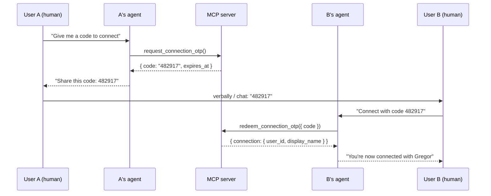

# User Connections via OTP — Design

**Date:** 2026-06-26  
**Status:** Approved  
**Builds on:** `docs/superpowers/specs/2026-06-25-mainfranken-it-events-design.md`, `docs/superpowers/specs/2026-06-25-auth-pat-rsvp-design.md` (auth + RSVP done)

## Goal

Let two authenticated users link their accounts via a short-lived 6-digit OTP shared human-to-human, then query each other's upcoming event RSVPs through their AI agent. Once connected, the link is permanent until either party disconnects.

**Example journey:**

1. User A asks their agent for a connect code → shares `482917` with User B.
2. User B tells their agent: *"Connect with code 482917"* → users are linked.
3. User B asks: *"What events is Martin going to in the next 6 months?"*
4. Agent returns events with `going` / `interested` status per event.
5. User B says *"I'm going to the Würzburg one"* → agent calls existing `set_rsvp`.

## Decisions (locked)

| Topic | Decision |
|-------|----------|
| Connection scope | **Global** — not tied to a specific event |
| Connection lifetime | **Permanent** until explicit disconnect or account deletion |
| RSVP visibility | Connected users see both `going` and `interested` RSVPs |
| Name lookup | Match by `display_name` (case-insensitive partial); disambiguate on multiple matches |
| OTP format | 6 digits, human-friendly |
| OTP lifetime | 15 minutes, single-use |
| Active OTPs | One active OTP per issuer; new request invalidates previous unused OTP |
| Disconnect | Either party can unlink via `remove_connection` |
| Architecture | Service-layer + MCP + REST parity (same pattern as RSVP) |
| Default date window | `date_to` defaults to now + 6 months when omitted |
| Participate / save | Reuse existing `set_rsvp` (`going` / `interested`) — no new tools |

## Approach

| Approach | Verdict |
|----------|---------|
| **A) Service-layer + MCP + REST** — shared services, thin adapters | **Selected** |
| B) MCP-only, defer REST | Rejected — inconsistent with RSVP; harder to test manually |
| C) RLS-driven cross-user visibility | Rejected — PAT path uses service role; app-layer checks match existing architecture |

## Architecture

```text
┌──────────────┐     PAT in header     ┌─────────────────────────────────────┐
│ MCP harness  │ ─ connect tools ────► │ Fastify API + MCP                   │
│              │                       │  services/request-connection-otp    │
│              │                       │  services/redeem-connection-otp   │
│              │                       │  services/list-connections          │
│              │                       │  services/list-connection-events    │
│              │                       │  services/remove-connection         │
└──────────────┘                       └──────────┬──────────────────────────┘
                                                  │
                                     ┌────────────▼──────────────────────────┐
                                     │ Supabase (service role)               │
                                     │  profiles · rsvps (existing)          │
                                     │  connections · connection_otps (new)  │
                                     └───────────────────────────────────────┘
```

**Privacy:** Services verify the requester is connected to the target user before returning RSVPs. No per-field `shared_fields` in v1 — connections see `display_name` plus RSVP statuses.

## Data model

### `connections`

Undirected link between two users. Stored canonically with `user_a < user_b`.

| Column | Type | Notes |
|--------|------|-------|
| `user_a` | uuid FK | → `auth.users`; always the smaller UUID |
| `user_b` | uuid FK | → `auth.users`; always the larger UUID |
| `created_at` | timestamptz | default `now()` |

PK: `(user_a, user_b)`. Check constraint: `user_a < user_b`.

**RLS:** Enabled; no client policies — service role only (same as `access_tokens`).

### `connection_otps`

Ephemeral handshake codes.

| Column | Type | Notes |
|--------|------|-------|
| `id` | uuid PK | |
| `issuer_id` | uuid FK | User who generated the code |
| `code_lookup` | text | Indexed lookup key (like PAT `token_lookup`) |
| `code_hash` | text | bcrypt hash of the 6-digit code |
| `expires_at` | timestamptz | `now() + 15 minutes` |
| `used_at` | timestamptz | null until redeemed |
| `used_by` | uuid FK | null until redeemed; redeemer's user id |
| `created_at` | timestamptz | |

**Invariants:**

- One **active** (unused, unexpired) OTP per issuer at a time.
- On `request_connection_otp`, invalidate (mark used or delete) any prior unused OTPs for that issuer.
- Plaintext code returned once to the agent; never stored or logged after response.

**RLS:** Service role only.

## Connect flow



## Query flow

1. User B asks: *"What events is Martin going to?"*
2. Agent calls `list_connection_events({ display_name: "Martin" })`.
3. If `ambiguous: true` → agent presents matches; human picks; agent retries.
4. Agent presents results with status labels (`going` vs `interested`).
5. User B says *"I'm going too"* → `set_rsvp({ event_id, status: "going" })`.

## MCP tools

| Tool | Auth | Input | Output |
|------|------|-------|--------|
| `request_connection_otp` | PAT | _(none)_ | `{ code: string, expires_at: string }` |
| `redeem_connection_otp` | PAT | `{ code: string }` — 6 digits | `{ connection: { user_id, display_name }, message: string }` |
| `list_connections` | PAT | _(none)_ | `{ connections: [{ user_id, display_name, connected_at }] }` |
| `list_connection_events` | PAT | `{ display_name?, date_from?, date_to?, status? }` | See below |
| `remove_connection` | PAT | `{ user_id: uuid }` | `{ ok: true }` |

### `list_connection_events` response

**Filters:**

- `display_name` — optional; case-insensitive partial match against connected users' `display_name`.
- `date_from` / `date_to` — filter on `events.starts_at`; default `date_to` = now + 6 months.
- `status` — optional `going` \| `interested`; default both.

**Behaviours:**

| `display_name` | Result |
|----------------|--------|
| Omitted | All connections' events merged |
| One match | That person's events |
| Multiple matches | `{ ambiguous: true, matches: [{ user_id, display_name }] }` — no events leaked |
| No match | Error: no connected user matching name |

**Event item shape:**

```json
{
  "event": {
    "id": "uuid",
    "title": "string",
    "starts_at": "ISO8601",
    "city": "string | null"
  },
  "attendee": {
    "user_id": "uuid",
    "display_name": "string",
    "status": "going | interested"
  }
}
```

## REST endpoints (mirror)

| Method | Path | Maps to |
|--------|------|---------|
| `POST` | `/me/connections/otp` | `request_connection_otp` |
| `POST` | `/me/connections/otp/redeem` | `redeem_connection_otp` — body: `{ code }` |
| `GET` | `/me/connections` | `list_connections` |
| `GET` | `/me/connections/events` | `list_connection_events` — query params match tool input |
| `DELETE` | `/me/connections/:user_id` | `remove_connection` |

## Services

| Module | Responsibility |
|--------|----------------|
| `request-connection-otp.ts` | Generate code, hash, invalidate prior OTPs, return plaintext once |
| `redeem-connection-otp.ts` | Validate code, create connection, mark OTP used |
| `list-connections.ts` | Return connected users with `display_name` |
| `list-connection-events.ts` | Resolve name, verify connection, join RSVPs + events |
| `remove-connection.ts` | Delete connection row (canonical pair lookup) |

Shared helper: `canonicalConnectionPair(userIdA, userIdB)` → `{ user_a, user_b }` with `user_a < user_b`.

## Error handling

| Case | Agent-facing message |
|------|---------------------|
| Invalid / unknown OTP | Code not found or already used |
| Expired OTP | Code expired — ask your friend to generate a new one |
| Self-connection | You cannot connect with yourself |
| Redeem own OTP | You cannot redeem your own code |
| Already connected | You're already connected with {display_name} (idempotent success) |
| `display_name` not found | No connected user matching '{name}' |
| Ambiguous name | Multiple matches — ask human to pick (structured `ambiguous` response) |
| Remove non-connection | You are not connected with this user |
| Missing / invalid PAT | Existing auth error |

## Security

- **OTP storage:** `code_hash` + `code_lookup` (same pattern as PAT tokens); never log plaintext code.
- **Brute-force:** Rate-limit failed `redeem_connection_otp` attempts per user (e.g. 5/min).
- **Request rate limit:** Rate-limit `request_connection_otp` per user (e.g. 5/hour).
- **6-digit space:** Mitigated by short TTL, single-use, and redeem rate limiting.
- **Privacy:** Only RSVPs of users connected to the requester are returned; ambiguous name resolution does not leak event data.

## Agent mapping

| User says | Tool |
|-----------|------|
| "Give me a code to connect" / "I want to link with someone" | `request_connection_otp` |
| "Connect with code 123456" | `redeem_connection_otp` |
| "Who am I connected with?" | `list_connections` |
| "What events is Martin going to?" | `list_connection_events({ display_name: "Martin" })` |
| "What are my friends attending?" | `list_connection_events()` |
| "I'm going to that one" | `set_rsvp({ event_id, status: "going" })` |
| "Save / mark interested in that one" | `set_rsvp({ event_id, status: "interested" })` |
| "Remove my connection with Martin" | `remove_connection({ user_id })` |

## Out of scope (this phase)

- Per-event connections or event-scoped OTP
- Per-user `shared_fields` privacy controls
- Local nicknames / aliases for connections
- Connection limits (max friends)
- QR codes or deep links for OTP delivery

## Testing

| Layer | Cases |
|-------|-------|
| Unit — OTP | Create → redeem → used; expiry; invalidate previous; self-connect blocked; redeem own OTP blocked |
| Unit — connections | List; remove; remove non-existent; duplicate connect idempotent |
| Unit — events query | Filter by name (exact, partial, ambiguous, no match); date default 6 months; status filter |
| Unit — privacy | User C cannot see user A's RSVPs through user B |
| Integration | MCP tool smoke per tool; REST route parity |

## Migration checklist

1. SQL migration: `connections`, `connection_otps` tables + indexes.
2. Services + custom error types.
3. MCP tools in `src/mcp/` (new `connections.ts` or extend `auth.ts`).
4. REST routes under `/me/connections`.
5. Tests + update `docs/FEATURES.md` and `SPEC.md` (align UC-6/7 to global connections).

## Implementation order (for planning)

1. Schema migration (`connections`, `connection_otps`)
2. OTP services (`request-connection-otp`, `redeem-connection-otp`)
3. Connection query services (`list-connections`, `list-connection-events`, `remove-connection`)
4. MCP tools
5. REST routes
6. Tests + docs
