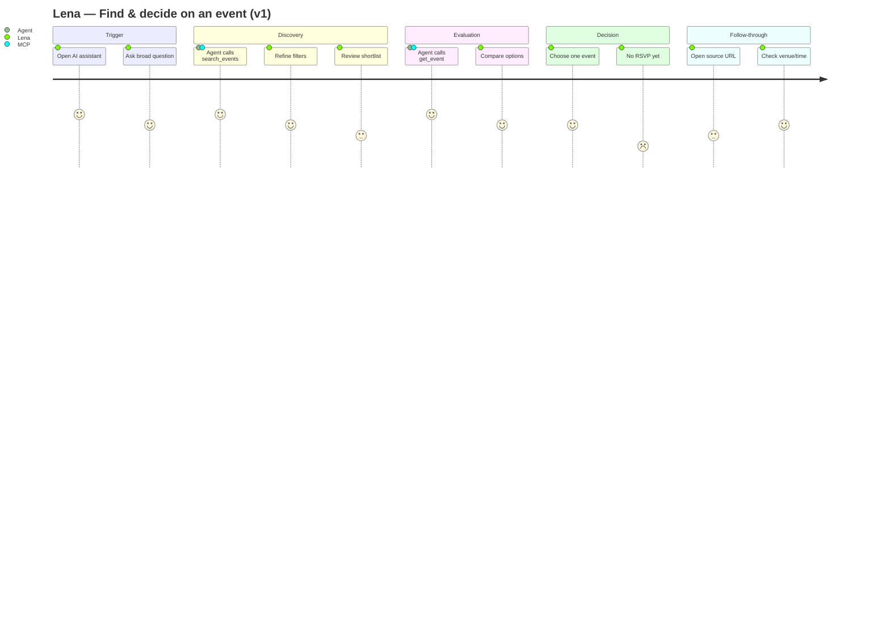

# UX Journey Map — Find & Decide on an Event

**Status:** Draft (assumption-based)  
**Date:** 2026-06-25  
**Method:** [StanVision UX journey mapping best practices](https://www.stan.vision/journal/best-practices-for-ux-journey-mapping) — one persona, one scenario, user perspective, kept simple.

**Related:** [SPEC.md](../../SPEC.md) (UC-4), [API+MCP find-events v1](../superpowers/specs/2026-06-25-api-mcp-find-events-design.md), [team design](../superpowers/specs/2026-06-25-mainfranken-it-events-design.md)

> **Confidence level:** This map is based on product intent and team assumptions. It is **not** validated by user interviews yet. Rows marked `assumption` should be revisited after first usability tests.

---

## Persona

**Name:** Lena — Tech professional in Mainfranken  
**Role:** Software engineer or IT lead at a regional company (Würzburg, Schweinfurt, Bamberg, Aschaffenburg)  
**Context:** Busy week, wants to stay connected to the local tech community without spending 20 minutes hunting across Meetup, LinkedIn, and association sites.

| | |
|---|---|
| **Goals** | Find a relevant IT event quickly; decide in one sitting whether it's worth attending |
| **Motivations** | Learning, networking, staying current on topics (cloud, AI, DevOps, etc.) |
| **Frustrations** | Event info scattered; unclear if an event is still current; too many irrelevant results |
| **Tech comfort** | Uses ChatGPT, Claude, or Gemini daily; expects natural-language search |
| **Primary channel** | Personal AI assistant (agent-first) — not a dedicated event app |

---

## Scenario

> Lena hears about a possible meetup next week. She opens her AI assistant and asks for IT events in Mainfranken that match her interests. She reviews one or two options and decides whether to attend.

**Scope of this map:** Discovery → evaluation → decision.  
**Out of scope (later maps):** RSVP, OTP connection, friends' events, website-only browsing.

**Trigger:** "I want to go to something useful this week/month."  
**Success:** Lena identifies one event she would realistically attend and knows how to register or get there.

---

## Success metrics (draft)

| Metric | Target (to validate) |
|---|---|
| Time to first relevant result | < 60 seconds from first prompt |
| Results feel trustworthy | User rates ≥ 1 result as "worth considering" |
| Decision confidence | User can state date, city, and registration next step without re-asking |
| Drop-off | User abandons after empty or confusing results |

---

## Journey stages

| Stage | User goal | User actions | Thoughts | Emotion | Touchpoints | Pain points | Opportunities | Confidence |
|---|---|---|---|---|---|---|---|---|
| **1. Trigger** | Realize she wants to find an event | Opens AI assistant; asks a broad question | *"What's happening in Mainfranken soon?"* | Curious, time-pressed | ChatGPT / Claude / Gemini | Doesn't know what to ask; vague prompts return vague answers | Suggest example prompts; default to upcoming + region | assumption |
| **2. Discovery** | Get a shortlist of relevant events | Refines by city, date, topic, free/paid | *"Show me DevOps meetups in Würzburg in July"* | Hopeful, focused | MCP `search_events` | Too many/too few results; irrelevant cities; stale events | Strong filters (`city`, `tags`, `date_from`, `is_free`); upcoming-first ordering | spec |
| **3. Evaluation** | Judge if one event fits | Asks for details on a specific result; compares options | *"Tell me more about the second one — where is it, who's organizing?"* | Analytical, cautious | MCP `get_event`; agent summary | Thin descriptions; missing venue; broken links; duplicate listings | Rich event fields (organizer, tags, location, url); agent-friendly error messages | assumption |
| **4. Decision** | Commit mentally to attend (or pass) | Picks one event; may ask for a reminder | *"That Stammtisch works — I'll go."* | Satisfied or indifferent | Agent conversation | No RSVP in v1 — decision stays informal; easy to forget | Future: `set_rsvp`; for now: clear CTA via source `url` | spec (RSVP deferred) |
| **5. Follow-through** | Know how to register and get there | Opens registration link; checks address/time | *"How do I sign up? Where exactly is it?"* | Practical | Event `url`, `location_name`, `address`, `city` | External registration UX is outside our control; bad URLs | Validate links at ingest; surface registration URL prominently in agent replies | assumption |

---

## Journey flow (current-state v1)

*Satisfaction scores (1–5) are assumptions — replace after usability testing.*

---

## Touchpoint inventory

| Touchpoint | Layer | v1 status | Notes |
|---|---|---|---|
| Natural-language prompt | User agent | Exists (client) | We don't control prompt UX |
| `search_events` | MCP | Planned | Core v1 tool |
| `get_event` | MCP | Planned | Core v1 tool |
| Event data (title, date, location, tags, url) | Supabase `events` | Seed data exists | Quality depends on ingest |
| REST `GET /events` | API | Planned | Parity with MCP; powers website |
| IT-Verband event list (`web/demo`) | Web | Partial | Read-only fallback; not Lena's primary path |
| RSVP / calendar reminder | MCP | Not in v1 | Phase 2 |

---

## Pain points (prioritized)

| # | Pain point | Impact | Effort | v1 action |
|---|---|---|---|---|
| P1 | Empty or irrelevant search results | High | Medium | Solid filter logic; seed + ingest data quality |
| P2 | Agent can't explain *why* an event matches | Medium | Low | Good tool descriptions; tags + organizer in response |
| P3 | User doesn't know how to phrase the query | Medium | Low | Document example prompts for demo/onboarding |
| P4 | Event detail too thin to decide | High | Medium | Require description, location, url in ingest schema |
| P5 | Broken or missing registration links | High | Medium | Validate `url` at ingest; agent surfaces link clearly |
| P6 | No way to save/commit attendance in-product | Medium | High | Defer RSVP to phase 2; accept "open link" as v1 CTA |

---

## UX opportunities for v1

1. **Agent-first defaults** — `search_events` should default to upcoming events in Mainfranken (reasonable `limit`, `starts_at ASC`).
2. **Scannable summaries** — Tool responses should be structured so the agent can present: title, date, city, tags, one-line why-it-matters, link.
3. **Helpful empty states** — e.g. *"No DevOps events in Schweinfurt in July — try Würzburg or remove the tag filter."*
4. **Clear next step** — Every result should end with an explicit CTA: registration URL or "Details" link.
5. **Demo script alignment** — Workshop/demo prompts that mirror Lena's real questions (see below).

---

## Example prompts (demo & test scenarios)

Use these for usability tests and hackathon demos:

1. *"Welche IT-Events gibt es in Mainfranken im Juli?"*
2. *"Zeig mir kostenlose Meetups in Würzburg."*
3. *"Gibt es DevOps- oder Cloud-Events in der Region?"*
4. *"Erzähl mir mehr über [Event-Titel] — wann, wo, wer organisiert?"*
5. *"Welches Event passt am besten, wenn ich nur einen Aber habe?"*

---

## Open research questions

- [ ] Does Lena start in an AI assistant, or does she still Google / check the IT-Verband site first?
- [ ] What minimum fields does she need before trusting a result? (title + date + city enough?)
- [ ] How does she prefer results ordered — soonest first, closest city, or topic match?
- [ ] What makes her abandon — empty results, too many results, or weak descriptions?
- [ ] After deciding, does she want RSVP in-chat or is an external link sufficient for v1?

---

## Next steps

1. Validate this map with 2–3 informal interviews (or a 15-min team walkthrough).
2. Run a task-based test once MCP v1 is live: *"Find a free IT event in Würzburg next month."*
3. Update satisfaction scores and pain points from real sessions.
4. Add a second map: **Connect with someone at an event** (OTP flow).
